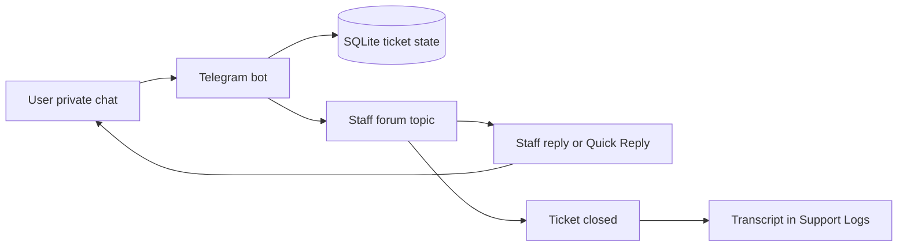
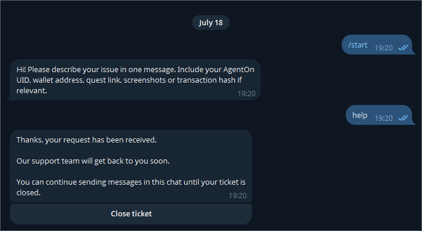
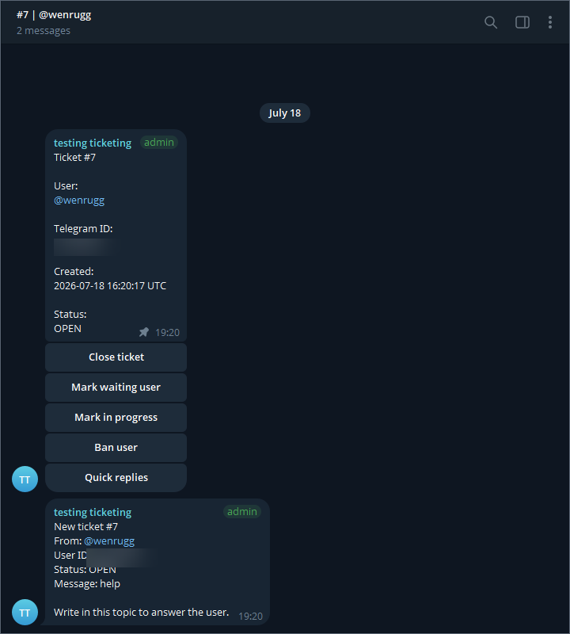
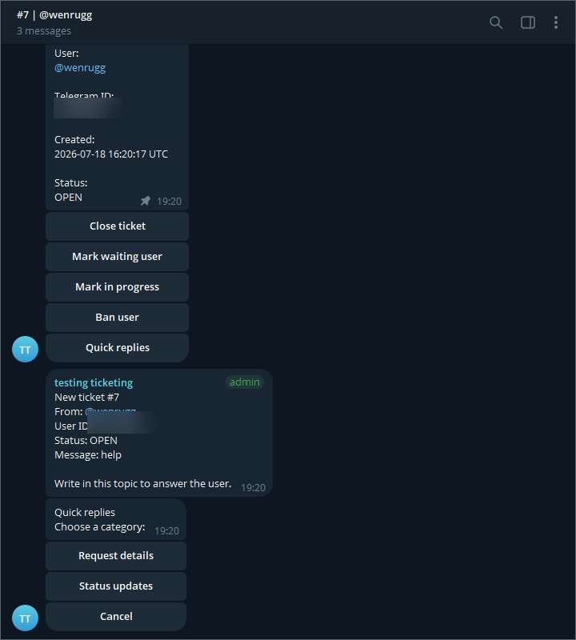
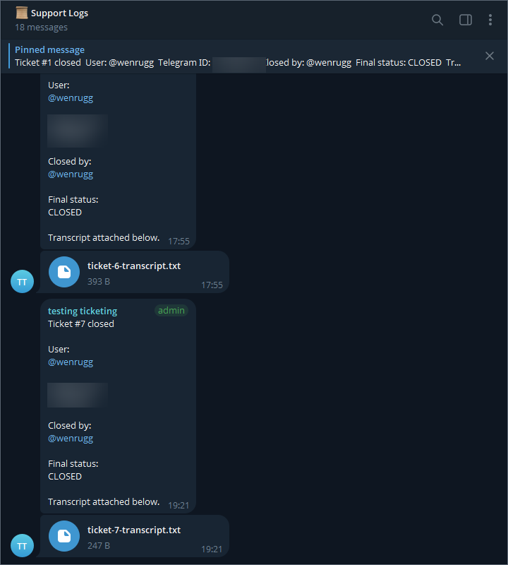

# Telegram Support Ticket Bot

A Telegram-native support desk that turns private user messages into structured staff forum topics, replies, and archived transcripts.

[](https://github.com/mikhail494/telegram-ticket-system/actions/workflows/ci.yml)
[](https://nodejs.org/)
[](https://www.typescriptlang.org/)
[](LICENSE)

Version: `1.1.0`

Users contact the bot in private chat, while staff work entirely in a dedicated Telegram forum supergroup. Each ticket receives its own topic, Quick Replies speed up routine responses, and closed conversations are archived as text transcripts in Support Logs.

## Highlights

- One ticket equals one Telegram forum topic.
- Bidirectional user and staff routing, including common Telegram media types.
- JSON-configured Quick Replies with categories, pagination, and transcript recording.
- Persistent ticket lifecycle, bans, settings, and idempotent SQLite migrations.
- Dedicated Support Logs archive with recovery when a topic is unavailable or misconfigured.
- Staff controls for status, closure, user lookup, and ban management.
- Automated regression coverage, Docker packaging, and GitHub Actions CI.

## How It Works



## Quick Start

```bash
git clone https://github.com/mikhail494/telegram-ticket-system.git
cd telegram-ticket-system
npm install
```

Create a local environment file, then configure the values described in [Environment Variables](#environment-variables):

```bash
# macOS/Linux
cp .env.example .env

# Windows PowerShell
Copy-Item .env.example .env
```

Start the bot in development mode:

```bash
npm run dev
```

Before starting it, create a Telegram supergroup with Topics enabled, add the bot as an administrator, and set `STAFF_CHAT_ID` to that group. The full setup is below.

## Ticket Workflow

`STAFF_CHAT_ID` must be a Telegram supergroup with Topics enabled.

1. A user sends the bot a private message.
2. The bot creates one ticket row and one forum topic.
3. The topic title is `#123 | @username`, or `#123 | user_123456789` when the user has no username.
4. The first topic message is pinned and contains the ticket number, user, Telegram ID, creation time, status, and staff instructions.
5. Follow-up user messages are added to the same topic while the ticket remains active.
6. Staff replies in the topic are routed back to the original user.
7. Closing a ticket marks it `CLOSED`, archives its transcript, and closes or deletes the topic when Telegram permits it.
8. The user's next message creates a completely new ticket and topic. Closed topics are never reused.

Ticket routing uses Telegram `message_thread_id`, not reply chains. Only one active ticket is kept per user for each configured staff chat.

## Quick Replies

Every active ticket topic has a `Quick replies` button under its pinned ticket summary.

1. Select a category.
2. Select a reply template.
3. The bot delivers the template to the ticket user as a normal clean text message.

Quick Reply delivery uses the same transcript path as a normal staff text reply, including the selecting staff member's identity. Sending one changes an `OPEN` ticket to `IN_PROGRESS`; `IN_PROGRESS` and `WAITING_USER` tickets retain their status.

`Back` returns to the category list. `Cancel` removes the menu without messaging the user. Categories show up to six templates per page, with `Previous` and `Next` controls when needed.

### Quick Replies Configuration

Templates live outside application code in [config/quick-replies.json](config/quick-replies.json). Each category has an `id`, button `title`, and templates; each template has an `id`, button `title`, and the `text` delivered to the user.

```json
{
  "version": 1,
  "categories": [
    {
      "id": "request_details",
      "title": "Request details",
      "templates": [
        {
          "id": "ask_uid",
          "title": "Ask for UID",
          "text": "Please send your AgentOn UID so we can check your account."
        }
      ]
    }
  ]
}
```

Validation rules:

- Category and template IDs use lowercase letters, numbers, and underscores only, up to 24 characters.
- Button titles are required and no longer than 32 characters.
- Template text is required and no longer than 3500 characters.
- Category IDs must be unique; template IDs must be globally unique across all categories.

The configuration is validated during startup. A missing, malformed, or invalid file prevents startup with an actionable error, so invalid templates cannot reach staff or users.

## Support Logs And Transcripts

The bot maintains one `📜 Support Logs` forum topic per `STAFF_CHAT_ID`. It records ticket closure summaries, transcript files, and ban-related events.

On startup, the bot reuses the configured topic when it is valid, reopens it when possible, and creates a replacement when it is missing, deleted, unavailable, or incorrectly points to a ticket topic. Settings are scoped per staff chat, so changing `STAFF_CHAT_ID` never reuses a topic ID from another group.

Use `/logs` in the staff group to show or create the current topic. Use `/setlogs` inside a non-ticket forum topic to assign it manually. Ticket topics cannot be assigned because they may be closed or deleted during archive processing; a legacy setting that points to one is automatically replaced with a safe Support Logs topic.

While a ticket is active, SQLite holds its messages temporarily. On closure, the bot writes `ticket-<id>-transcript.txt`, uploads the closure summary and transcript to Support Logs, records the archive message IDs, removes the temporary message rows, and deletes the local file. If upload fails, messages are retained and pending archives are retried after restart.

Media is represented as attachment text in the transcript. User media is not duplicated into application storage or Support Logs.

## Commands

### User Commands

| Command | Purpose |
| --- | --- |
| `/start` | Start the bot and view intake instructions. |
| `/status` | Show the latest ticket status. |
| `/mytickets` | Show recent tickets. |
| `/help` | Show user help. |
| `Close ticket` button | Close the current active ticket. |

### Staff Commands

| Command | Purpose |
| --- | --- |
| `/help` | Show staff help in the staff group or a ticket topic. |
| `/chatid` | Show the current staff chat ID. |
| `/whois` | Show the current ticket and user information inside a ticket topic. |
| `/ticket <id>` | Show ticket details. |
| `/close <id>` | Close a ticket. |
| `/ban <telegram_id> [reason]` | Prevent a user from opening tickets. |
| `/unban <telegram_id>` | Restore a user's ticket access. |
| `/bans` | List banned users. |
| `/setlogs` | Assign the current non-ticket topic as Support Logs. |
| `/logs` | Show or create the current Support Logs topic. |
| `Quick replies` button | Choose and send a configured response in an active ticket topic. |

`/help` is context-aware. On first use of a new `STAFF_CHAT_ID`, the bot also posts one onboarding message to the staff group's main topic. The marker is stored per staff chat, so a different configured group receives its own onboarding message.

## Telegram Setup

### Staff Supergroup

1. Create a Telegram group and convert it to a supergroup if prompted.
2. Enable Topics in group settings.
3. Add the bot and promote it to administrator.
4. Grant these permissions:
   - Manage topics
   - Send messages
   - Read messages
   - Pin messages
   - Delete messages, recommended for deleting archived ticket topics
   - Ban users, optional when staff handle bans through the bot

The bot needs Manage topics to create, reopen, close, and delete ticket or Support Logs topics.

### BotFather

1. Message `@BotFather` and run `/newbot`.
2. Copy the issued token into `BOT_TOKEN`.
3. Keep the token out of source code and Git history.

### Get `STAFF_CHAT_ID`

After the bot is running in the staff group, run `/chatid` there. The bot replies with the chat ID to place in `STAFF_CHAT_ID`. This command is staff-only and is unavailable in private chat.

## Configuration

### Environment Variables

Create `.env` from `.env.example`:

```bash
BOT_TOKEN=<telegram-bot-token>
STAFF_CHAT_ID=<telegram-supergroup-id>
DATABASE_URL=file:./data/support.db
LOG_LEVEL=info
```

Required in Railway and other deployments:

- `BOT_TOKEN`
- `STAFF_CHAT_ID`
- `DATABASE_URL`

`LOG_LEVEL` is optional. Never commit `.env`; `.env.example` is safe to commit because it contains placeholders only.

## Testing

Run the release checks from the project root:

```bash
npm exec tsc -- -p tsconfig.json --noEmit
npm run test:typecheck
npm test
npm run build
```

The current suite contains 66 automated tests covering Quick Replies configuration and delivery, Support Logs safety, and staff reply regression behavior.

## Project Structure

```text
src/                 Bot handlers, routing, SQLite access, archives, and Quick Replies loader
config/              Editable Quick Replies template configuration
test/                Node test suites and Telegram API harness
.github/workflows/   Continuous integration workflow
Dockerfile           Production container build
```

Runtime data belongs in the ignored `data/` directory locally, or on persistent storage in production.

## Deployment

### Docker

The image packages `config/quick-replies.json` and validates it while building. For production, mount persistent storage at `/data` and use:

```bash
docker build -t telegram-support-ticket-bot .
docker run --env-file .env -e DATABASE_URL=file:/data/support.db -v support-data:/data telegram-support-ticket-bot
```

`/data` must be persistent. Without a Docker volume or equivalent persistent disk, tickets, bans, settings, and migration state are lost when the container is replaced.

### Railway

1. Push the repository to GitHub and create a Railway project from it.
2. Use the included Dockerfile.
3. Add a volume mounted at `/data`.
4. Set `BOT_TOKEN`, `STAFF_CHAT_ID`, `DATABASE_URL=file:/data/support.db`, and optionally `LOG_LEVEL=info`.
5. Deploy one replica only.

Long polling must not run from multiple replicas simultaneously. SQLite needs the Railway volume to survive restarts.

## Security Model

- Never commit `.env` or log `BOT_TOKEN`.
- Treat every participant who can interact in `STAFF_CHAT_ID` as trusted staff. They can reply to users, change ticket status, close tickets, ban or unban users, and configure Support Logs.
- Point `STAFF_CHAT_ID` only at a controlled staff group.
- Keep SQLite on persistent storage and review staff access before making the repository public.
- Support Logs is the durable archive; the bot does not download or duplicate user media into application storage.

## Troubleshooting

### Telegram API timeout

Check network stability, restart the process, and make sure only one bot replica is running.

### Wrong `STAFF_CHAT_ID`

Staff commands and callbacks work only in `STAFF_CHAT_ID`. Confirm it with `/chatid` in the configured staff group.

### The bot does not create ticket topics

Verify that the staff chat is a supergroup, Topics are enabled, the bot is an administrator with Manage topics permission, and the configured ID starts with `-100`.

### Support Logs or transcript upload fails

Confirm the bot can manage topics and send documents in the staff group. For `message thread not found`, `topic not found`, or `chat not found`, the bot creates a fresh Support Logs topic for the current staff chat and retries the archive once. Pending closed-ticket archives are retried after restart.

### Ticket summaries are not pinned

Grant the bot permission to pin messages. Ticket routing continues even when pinning fails.

### Archived topics are not deleted

The bot tries `deleteForumTopic` first and falls back to `closeForumTopic`. Grant Delete messages permission for full topic deletion.

### SQLite persistence on Railway or Docker

Use `DATABASE_URL=file:/data/support.db` with a persistent volume mounted at `/data`.

## Screenshots

<table>
  <tr>
    <td width="50%" valign="top">
      <strong>User Intake</strong><br />
      
      <br />
      <sub>Private user conversation with ticket creation and self-service closure.</sub>
    </td>
    <td width="50%" valign="top">
      <strong>Ticket Workspace</strong><br />
      
      <br />
      <sub>Dedicated forum topic with pinned ticket context and staff controls.</sub>
    </td>
  </tr>
  <tr>
    <td width="50%" valign="top">
      <strong>Quick Replies</strong><br />
      
      <br />
      <sub>Config-driven response categories available directly inside the ticket topic.</sub>
    </td>
    <td width="50%" valign="top">
      <strong>Support Logs</strong><br />
      
      <br />
      <sub>Closed-ticket summaries and transcript files archived in a dedicated topic.</sub>
    </td>
  </tr>
</table>

## Release

See [CHANGELOG.md](CHANGELOG.md) for release history and [LICENSE](LICENSE) for licensing terms.
