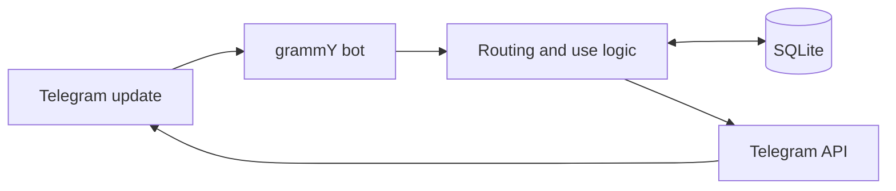
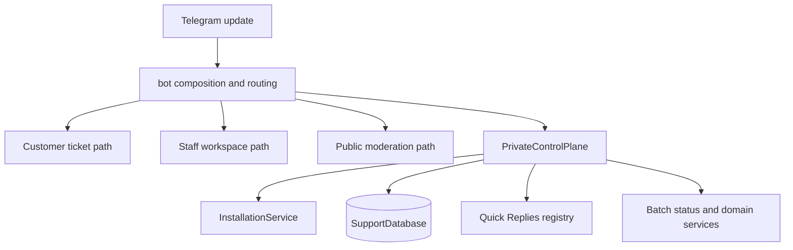
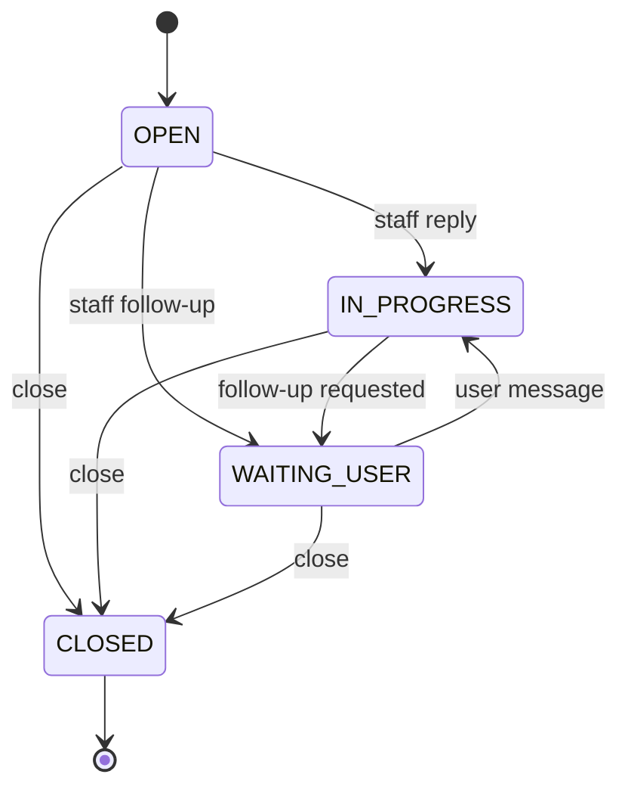
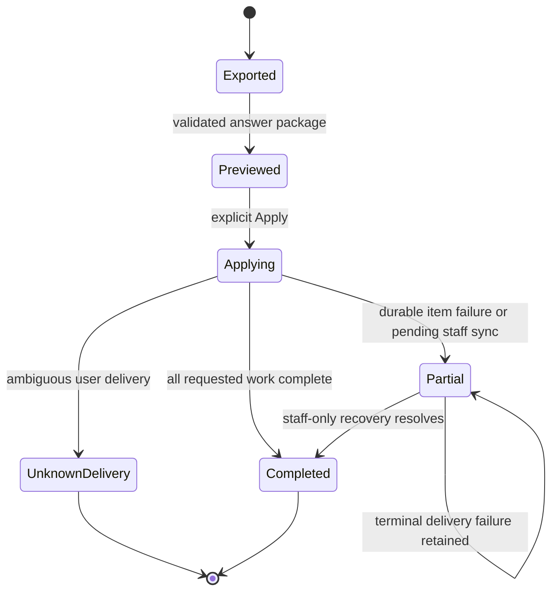
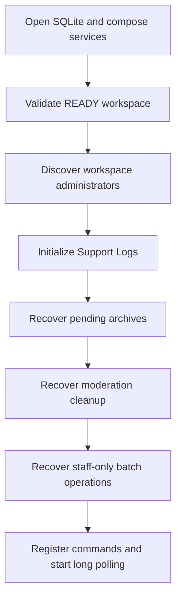

# Architecture

## Overview

This is a single-instance Telegram support service written in TypeScript. grammY receives Telegram updates, `createBot` composes routing and application services, and SQLite stores durable operational state. Telegram remains the system of interaction; SQLite supplies restart-safe state, idempotency, and recovery.

`src/index.ts` owns process startup: it loads configuration, opens `SupportDatabase`, initializes persistent Quick Replies and the installation service, composes the bot, then performs ready-workspace recovery before long polling starts.

`src/bot.ts` remains the grammY composition root and routes four distinct update paths: customer ticket ingress, the staff workspace, managed public-chat moderation, and private operator control. `PrivateControlPlane` owns private operator dashboard/navigation rendering, authoritative-screen lifecycle, stale callback rejection, editor and picker sessions, and callback/input dispatch for Team, public chats, moderation, Support settings, and Quick Replies. It deliberately remains grammY-aware because it is the Telegram adapter for OWNER and staff administration, while installation, Quick Reply, moderation, and Batch services retain their business state.

## Ticket Lifecycle

Each active support ticket is scoped to one staff workspace and has one dedicated Telegram forum topic. User messages create or continue the ticket; staff replies and Quick Replies use the same delivery and transcript paths.

Closing archives a transcript through the existing Support Logs path. Ticket and archive records make restart recovery safe when a Telegram operation is interrupted.

## Batch Workflow

Ticket batches export active tickets as one ZIP and accept a validated answer package. Preview and Apply are explicit operator actions; durable package and item states prevent replaying successful delivery.

`UNKNOWN_DELIVERY` is conservative: when Telegram delivery may have happened but cannot be confirmed, the service records the ambiguity instead of blindly retrying and risking a duplicate user message. Staff-only synchronization has its own durable retry state and can recover without resending user delivery.

## Startup and Recovery

For a READY installation with an active workspace, startup performs ordered recovery before polling updates.

Migrations are idempotent and recorded in `schema_migrations`. The database uses SQLite WAL mode, allowing the single bot process to make durable transactional updates while supporting recovery after restart.

## Cross-Cutting Reliability

- **RBAC and installation state:** `InstallationService` manages setup state, owner pairing, team roles, workspace membership, and authorization mode. `PrivateControlPlane` tracks exactly one authoritative private operator screen and rejects callbacks from retired screens.
- **Moderation:** managed public chats retain independent configuration. Violations, sanction cycles, and cleanup jobs persist; warnings are topic-aware while sanctions remain chat-wide.
- **Batch idempotency:** stable package/item identities, delivery diagnostics, and staff-only retry records prevent duplicate replies, transcripts, archives, and topic events.
- **Delivery taxonomy:** Telegram failures are normalized into actionable categories and permanence. Confirmed permanent failures are not automatically retried; ambiguous operations use `UNKNOWN_DELIVERY`.

## Deliberate Tradeoffs and Future Direction

The application favors a compact single-process deployment: `createBot` is still a large composition closure and `SupportDatabase` spans several domains. The extracted private control-plane boundary removes ownership of private UI state from that closure, but it does not attempt to redesign the product flows. Some short-lived interaction state, such as active picker or input sessions, remains in memory while durable business outcomes are persisted in SQLite. These choices reduce moving parts for the current operating model, but they make navigation and future scaling harder.

The intended direction is incremental extraction behind existing seams, not a rewrite: isolate focused application services, narrow database ownership by domain, and persist only interaction state that demonstrably needs restart durability.
